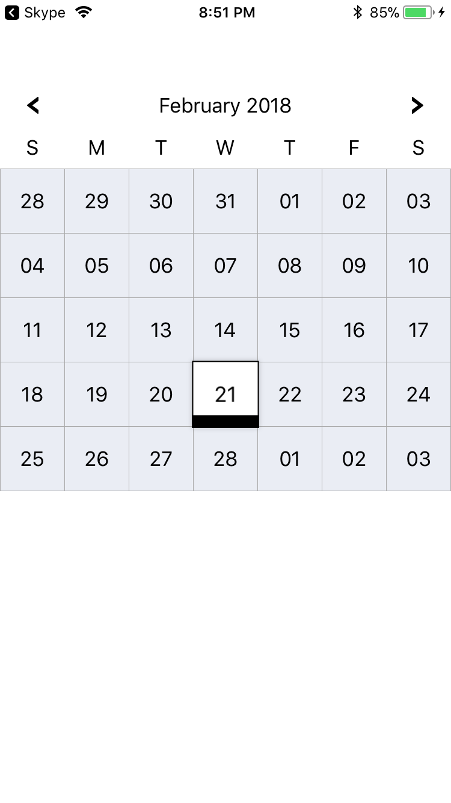
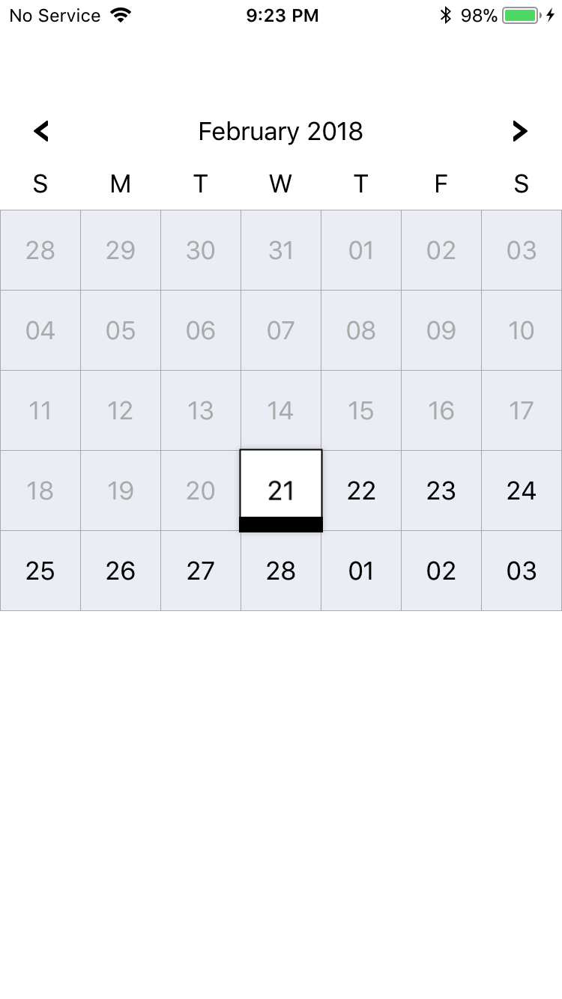

# CACalendarView 
CacalendarView allow to display calendar within the app with flat and and custom UI. A custom caledar can be display with ew lines of code.
Download CACalendarViewSample and add CACalendarView to project.
Add below code for display CACalendarView

    CGSize size = [UIScreen mainScreen].bounds.size;
    CACalendarView *calendarView = [[CACalendarView alloc] initWithFrame:CGRectMake(0, 70, size.width, size.height-200)];
    calendarView.backgroundColor  = [UIColor whiteColor];
    //set delegate
    calendarView.delegate = self;
    [self.view insertSubview:calendarView atIndex:0];
    
    Implement CACalendarDelegate for get selected date
    -(void) didSelectedDate:(NSDate *)date{
        //date format 2017-09-13
        NSDateFormatter *formatter = [[NSDateFormatter alloc] init];
          [formatter setDateFormat:@"yyyy-MM-dd"];
      NSLog(@"selected date = %@  and string = %@", date, [formatter stringFromDate:date]);
    }

#
 run the application, you can see CACalendarView
    
    
 if you want to disable selection of  previous dates just add a line of code
    
    calendarView.isDisablePreviousDate = true; 
    
 
    
    
  you can also set date on calendar by using below code
  
    [calendarView setSetectedDate:[NSDate date]];
    
     

